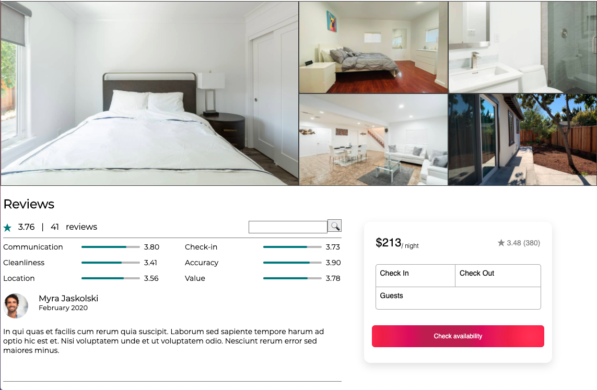

# houses-rental

This is full stack “House Rentals” web app with microservice architecture

Technology Stack:React, CSS modules, Javascript, HTML, Webpack, Node.js, Express, MySQL,Docker, AWS

Built modularize components using RESTful API and React.

Implemented TDD unit and integration tests to achieve 90% code coverage.
